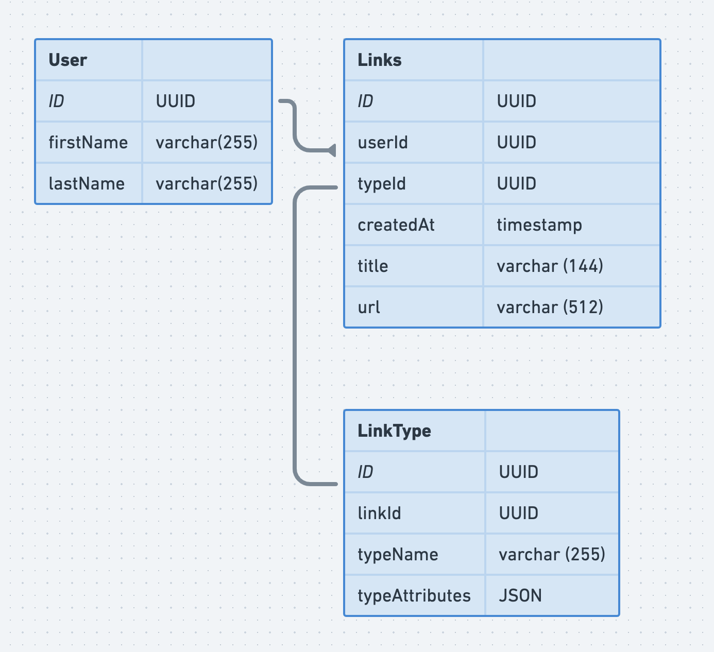

# links-api
API to create and return different types of links

# The Problem
We have three new link types for our users.

1. Classic
	- Titles can be no longer than 144 characters.
	- Some URLs will contain query parameters, some will not.
2. Shows List
	- One show will be sold out.
	- One show is not yet on sale.
	- The rest of the shows are on sale.
3. Music Player
	- Clients will need to link off to each individual platform.
	- Clients will embed audio players from each individual platform.
	
You are required to create a JSON API that our front end clients will interact with.

- The API can be GraphQL or REST.
- The API can be written in your preferred language.
- The client must be able to create a new link of each type.
- The client must be able to find all links matching a particular userId.
- The client must be able to find links matching a particular userId, sorted by dateCreated.


## Your Solution

- Consider bad input data and the end user of your API - we're looking for good error handling and input validation.
- If you are creating a GraphQL API, think about the access patterns the client may use, and think about the acces patterns the client may not use. Try not to [Yak Shave](https://seths.blog/2005/03/dont_shave_that/)
- Consider extensibility, these are 3 of hundreds of potential link types that we will be developing.


## Rules & Tips

- Choose the language and environment of your choice, just include documentation on how to run your code.
- Immutability and functional programming is looked upon favorably.
- You cannot connect to a real world database - document your schema design.
- Mocking third parties is looked upon favorably.
- @todo comments are encouraged. You aren't expected to complete the challenge, but how you design your solution and your ideas for the future are important.

---
# Submission
Set up your own remote git repository and make commits as you would in your day to day work. Submit a link to your repo when you're finished.

# Running the Code locally
The following depencendies must be installed on your local machine for the project to run:
- [Node.js](https://nodejs.org/en/) v17.x

1. Clone the repo:\
``` git clone https://github.com/xkatharinerussell/links-api.git```
3. Install npm dependencies:\
```npm install```

4. Start the application:\
``` npm run start ```

5. Hit the API endpoint at:\
POST: http://localhost:8081/user/{userId}/link \
GET: http://localhost:8081/user/{userId}/links \

**NOTE: See example requests in postman collection inside spec folder**

# Running unit tests
Unit tests will run and automatically produce a coverage report.\

1. Run command:\
``` npm run test ```

# Database Schema


**showList TypeAttributes Schema**
- date (string)
- venue (string)
- status (enum [Sold Out, Available, Coming Soon])
- url (string)

**musicLinks TypeAttributes Schema**
- title (string)
- icon (string) TODO: this should be a link to S3 bucket
- url (string)
- featured (boolean)